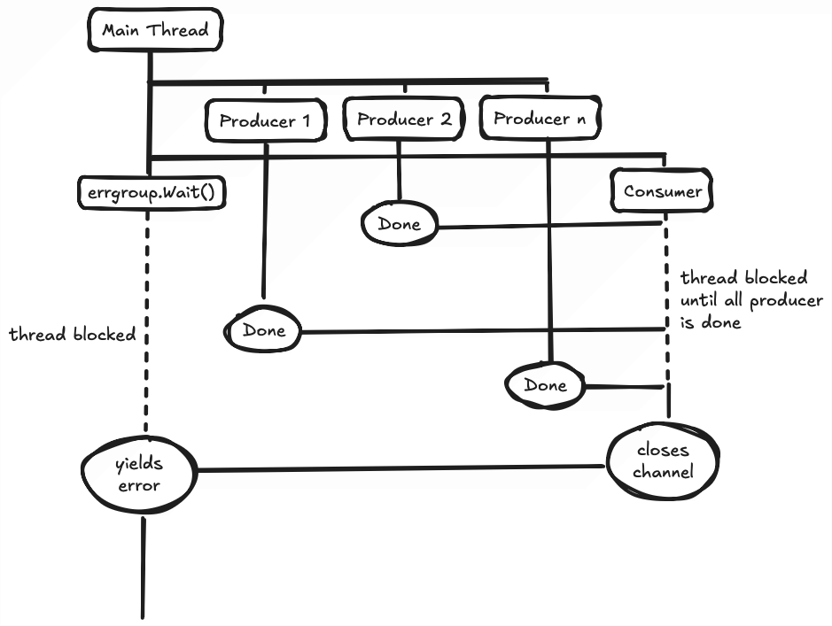

+++
date = '2025-08-03T22:49:02+07:00'
draft = true
title = 'Creating Concurrent HTTP Requests in Go'
tags = ['Programming']
+++

A while ago I've had the pleasure of having to hit a particularly slow third party API multiple times in a single request. The amount of requests sent is variable and so the time taken by this single request can be arbitrarily slow, as shown in the graphics below.


Obviously this can get out of control quick. As I was writing in Go, I immediately went to the universal hammer of all Go code: Goroutines. Ideally, the timeline should look more like this:


This way, even the biggest request will only be as slow as its slowest API response + some overhead from coroutines.

## First Step - The Humble Waitgroup

At first I wrote the most basic goroutine usage with waitgroup.

```go
var wg sync.WaitGroup
for _, v := range payloads {
    wg.Add(1)
    go func(){
        defer wg.Done()
        sendRequest(v)
    }()
}
wg.Wait()
```

The scope of sendRequest is beyond this post. However, it is just a standard HTTP client request based on the payload value. I trust most people reading this post would already be familiar with how to do that, or at least the general idea of it.

Clearly, this is far from enough. For one, I'm not capturing the response. Second, I am not handling any errors. Let's tackle them one by one.

## Second Step - Channel for My Answers

I figured that since all of the requests may finish at different times, I should probably set up a channel to accept them one by one.

```go
var wg sync.WaitGroup
resCh := make(chan Response)
for _, v := range payloads {
    wg.Add(1)
    go func(){
        defer wg.Done()
        sendRequest(v, resCh)
    }()
}
go func(){
    wg.Wait()
    close(resCh)
}()
wg.Wait()
for res := range resCh {
    // do something
} 
```
```go
// Inside of sendRequest
func sendRequest(payload Payload, resCh chan<- Response) {
    var result Response
    //...
    resCh <- result
}
```

Now we're getting somewhere. The payload loop would spawn producer threads that send their results down the channel. In the main thread, another consumer thread is spawned to wait on the waitgroup, and then close the channel.

If you're unfamiliar with how Go handles channels, the following code will block the thread forever until the channel is closed.

```go
for res := range resCh {
    // do something
} 
```

Due to that, when we have no idea how many channels will be coming in, we have to spawn a consumer thread that will wait on all waitgroups and manually close the channel to allow the main thread to continue.

Notice also how I explicitly declare the `resCh` inside of `sendRequest` parameter as a receive only channel.

```go
func sendRequest(payload Payload, resCh chan<- Response)
```

For this case, it is not that necessary, but being explicit about how a function will use a channel can prevent massive headache down the line, such as a function that unexpectedly consumes a channel instead of producing, leading to starvation in the main thread.

## Third Step - Error Handling, My Beloved

Now we have our HTTP requests firing and their responses ready to be used. A bad programmer would call it a day here and open a PR. However, in Go, we love our `if err != nil` checks. So, we should add some error handling to our code.

The question is, how? The first kneejerk reaction would be to create an error channel that the `sendRequest` function can push an error value to. However, this can get real messy and confusing. A more elegant solution would be to use [errgroup](https://pkg.go.dev/golang.org/x/sync/errgroup).

```go
errGroup, ctx := errgroup.WithContext(context.Background())
resCh := make(chan Response)
for _, v := range payloads {
    errGroup.Go(func() error {
        return sendRequest(ctx, v, resCh)
    })
}
go func(){
    errGroup.Wait()
    close(resCh)
}()
if err := errGroup.Wait(); err != nil {
    return err
}
for res := range resCh {
    // do something
} 
```
```go
// Inside of sendRequest
func sendRequest(
    ctx context.Context,
    payload Payload, 
    resCh chan<- Response) {
    var result Response
    // ...
    req, err := http.NewRequestWithContext(ctx, METHOD, URL, DATA)
	if err != nil {
		return err
	}
    //...
    select {
        case resCh <- result: return nil
        case <- ctx.Done(): return ctx.Err()
    }
}
```

That's quite a lot, so let's go through it one by one.

First, notice how we've ditched waitgroup for errgroup. You can think of errgroup as a more convenient version of waitgroup. Instead of spawning a goroutine and then doing the classic
```go
wg.Add(1)
defer wg.Done()
```
Errgroup instead got a `.Go` method that would spawn a thread of the given closure function. Errgroup also has the `.Wait` method which would block a thread until all spawned errgroup has closed. The special thing about this method is that it also yields an `error` value based on the return of the closure functions given to `.Go`.

Some of you might be wondering, "hey, why's `.Wait` being called twice here?". The answer to that is that the `.Wait` inside of the `go func` is your usual consumer thread. It will wait until all errgroup is done, and then close the channel. Nothing special here.

The `.Wait` on the main thread, however, will block the thread until the errgroup is done. This ensures that no requests are dropped before the program continues to process the responses.



## Conclusion

And so, our little concurrent HTTP request handler is done. Some people think that Goroutines and channels are the confusing part of Go language. Personally, I find them to be intuitive and way easier than rawdogging `pthreads` in C. Much less confusing than web workers too, but maybe that's just due to my inexperience with it.